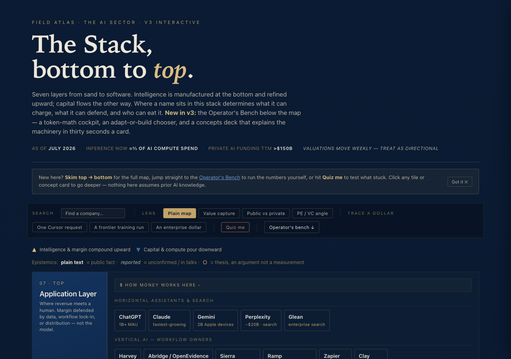

# The AI Stack — Interactive Field Atlas

An interactive map of the AI industry stack — from silicon to application layer — built to teach fluency fast: where value accrues, where margin gets squeezed, and how a dollar actually flows through the ecosystem.

**Live:** https://aistacked.netlify.app/



## What it does

- **Seven-layer stack** (silicon → compute → training/RL → labs → inference → orchestration/agents → applications), each with an economics breakdown (margins, moats, chokepoints, who's eating whom)
- **~28 clickable company profiles** — what they sell, who buys, business model, dependencies, moat, and what kills them
- **3 money-flow traces** — follow a literal dollar through the stack for a Cursor request, a frontier training run, and an enterprise contract
- **3 analytical lenses** — value capture, public vs. private, and a PE/VC angle on where non-venture capital plays
- **Company search** — filter every tile on the map by name
- **The Operator's Bench** — *Your AI Bill*, a personal cost calculator (what your own usage costs per query and per month, whether a subscription beats pay-as-you-go, and what running open models locally would cost); an "adapt or build" decision tool (prompting vs. RAG vs. fine-tuning vs. agents); and a 16-card concepts deck covering the underlying ML mechanics and how to work with agents. Points out to live tools (Price Per Token, OpenRouter, Hugging Face, LM Studio) for current numbers
- **Quiz mode** — 20 questions testing the concepts above, not just recall
- Every claim is tagged **fact**, _reported_, or **○ thesis** — the map is explicit about what's measured vs. argued

## Architecture

Content and presentation are deliberately separated:

| File | Role |
|---|---|
| `data.json` | Every fact on the map — the 7 layers, their tiles and groups, company profiles, money-flow traces, lens copy, quiz bank, and the concepts deck. This is the part that goes stale (valuations, new deals, new companies) and the only file that needs to change to refresh the map's content. |
| `index.html` | The page shell — header, control bar, drawer, quiz modal, empty containers the renderer fills in. No factual content lives here. |
| `app.js` | Fetches `data.json`, renders it into the DOM, and wires every interaction (drawer, lenses, traces, search, quiz, the Bench calculators). |
| `styles.css` | All visual styling. |

No framework, no build step, no npm dependencies — plain HTML/CSS/JS, chosen deliberately so the whole thing runs anywhere with nothing to install.

**Why this split matters:** because the data lives in one JSON file instead of being hand-authored into markup, a script (or a scheduled agent) can rewrite `data.json` — new deals, updated valuations, new companies — without touching the rendering code at all. That's the prerequisite for the map ever refreshing itself on a schedule rather than by hand.

## Running locally

`app.js` fetches `data.json` via `fetch()`, which browsers block on the `file://` protocol — so open `index.html` directly and the page will show a "serve this locally" error. Run a local static server instead:

```
git clone <this-repo>
cd ai-stack-field-atlas
python3 -m http.server 8000
```

Then open `http://localhost:8000/`.

## Deployment

Deployed on Netlify directly from this repo (auto-deploys on push to `main`). Any static host works identically — GitHub Pages, Vercel, or a plain file server — since `fetch("data.json")` resolves as a same-origin request wherever the files are served from together.

## Provenance

Content current as of July 2026; company data, deal terms, and valuations are directional and move fast — treat as a teaching snapshot, not a live feed. Reviewed monthly. Built and maintained by [Bakul Badwal](https://www.linkedin.com/in/bakulbadwal/) — MBA Candidate, UVA Darden, Class of 2027 — with Claude Code.

## License

MIT — see [LICENSE](LICENSE).
